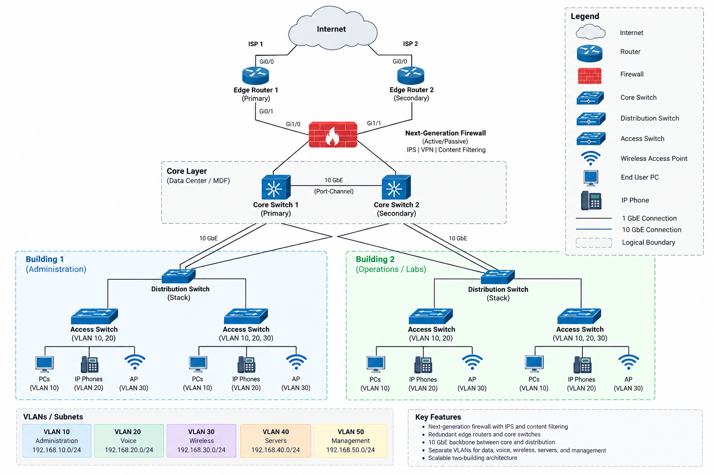

# Enterprise Secure Network Design

A secure and scalable enterprise network architecture designed for a simulated organization with 678 employees across two buildings.

## Project Overview

This project presents a proposed modern network infrastructure for a simulated enterprise environment. The design focuses on supporting hundreds of users while improving network performance, scalability, reliability, wireless connectivity, and security.

The proposed architecture uses a high-speed fiber backbone, network segmentation, secure wireless access, redundant infrastructure, and Quality of Service (QoS) policies to support different types of business traffic.

## Project Goals

- Design a scalable network for 678 employees across two buildings
- Segment network traffic to improve security and management
- Estimate network traffic and bandwidth requirements
- Design a 10 Gbps backbone for high-capacity communication
- Provide secure enterprise wireless connectivity
- Prioritize latency-sensitive applications using QoS
- Incorporate redundancy and high availability
- Apply layered network security controls

## Network Topology

The following topology illustrates the proposed enterprise network architecture, including redundant edge routing, firewall protection, a high-speed core layer, segmented building networks, and separate VLANs for business services.

## Network Design Highlights

- 10 Gigabit Ethernet backbone
- Fiber connectivity between buildings
- Layer 3 switching
- VLAN-based network segmentation
- Wi-Fi 6 wireless infrastructure
- WPA3-Enterprise wireless security
- 802.1X authentication
- Separate corporate and guest wireless access
- Next-generation firewall protection
- IDS/IPS monitoring
- Redundant edge and core infrastructure
- Quality of Service (QoS) for VoIP, video, and business applications

## Traffic & Capacity Planning

The network was designed around estimated traffic requirements for different departments and services.

Estimated internal traffic is approximately **2.9 Gbps**, with additional demand from wireless devices and communication between buildings.

Peak wireless usage is estimated at approximately **0.8–1.2 Gbps**, while inter-building traffic may reach approximately **1–1.5 Gbps**.

Based on these requirements, a **10 Gbps fiber backbone** provides sufficient capacity for current traffic while allowing room for peak utilization and future growth.

## Quality of Service (QoS)

QoS policies prioritize applications based on their sensitivity to latency, jitter, and packet loss.

| Traffic Type | QoS Target |
|---|---|
| VoIP | < 150 ms latency |
| Video | < 200 ms latency |
| Jitter | < 30 ms |
| VoIP Packet Loss | < 1% |
| Critical Data | Near-zero packet loss |

Traffic prioritization includes:

- **EF** — VoIP
- **AF41/42** — Video
- **AF21/22** — Business applications

## Security Approach

The proposed network uses multiple layers of security, including:

- VLAN-based network segmentation
- WPA3-Enterprise wireless security
- 802.1X authentication
- Next-generation firewall protection
- IDS/IPS monitoring
- Isolated guest wireless access
- Network access controls
- Restricted access to network management resources
- Security event and network-device logging

## Project Documentation

Detailed technical documentation is available within the repository:

- [Network Architecture](docs/network-architecture.md) — Hierarchical architecture, core/distribution/access layers, redundancy, and inter-building connectivity
- [Security Design](docs/security-design.md) — Firewall protection, VLAN segmentation, secure wireless access, authentication, access control, and monitoring
- [Traffic & Capacity Analysis](analysis/traffic-analysis.md) — Bandwidth estimates, traffic requirements, and 10 GbE backbone capacity planning
- [Quality of Service Design](analysis/qos-design.md) — Traffic prioritization strategy for VoIP, video, business applications, and general network traffic

## Skills Demonstrated

- Enterprise Network Design
- Network Architecture
- VLAN Segmentation
- Network Security
- Traffic & Capacity Planning
- Quality of Service (QoS)
- Layer 3 Switching
- Wi-Fi 6
- WPA3-Enterprise
- 802.1X Authentication
- Firewall & IDS/IPS Concepts
- High Availability & Redundancy
- Technical Documentation

## Project Summary

This project demonstrates the design and analysis of a secure and scalable enterprise network for a simulated two-building organization with 678 employees.

The proposed architecture combines network segmentation, redundant infrastructure, secure wireless connectivity, traffic prioritization, layered security controls, and capacity planning to support current business requirements while allowing for future growth.
